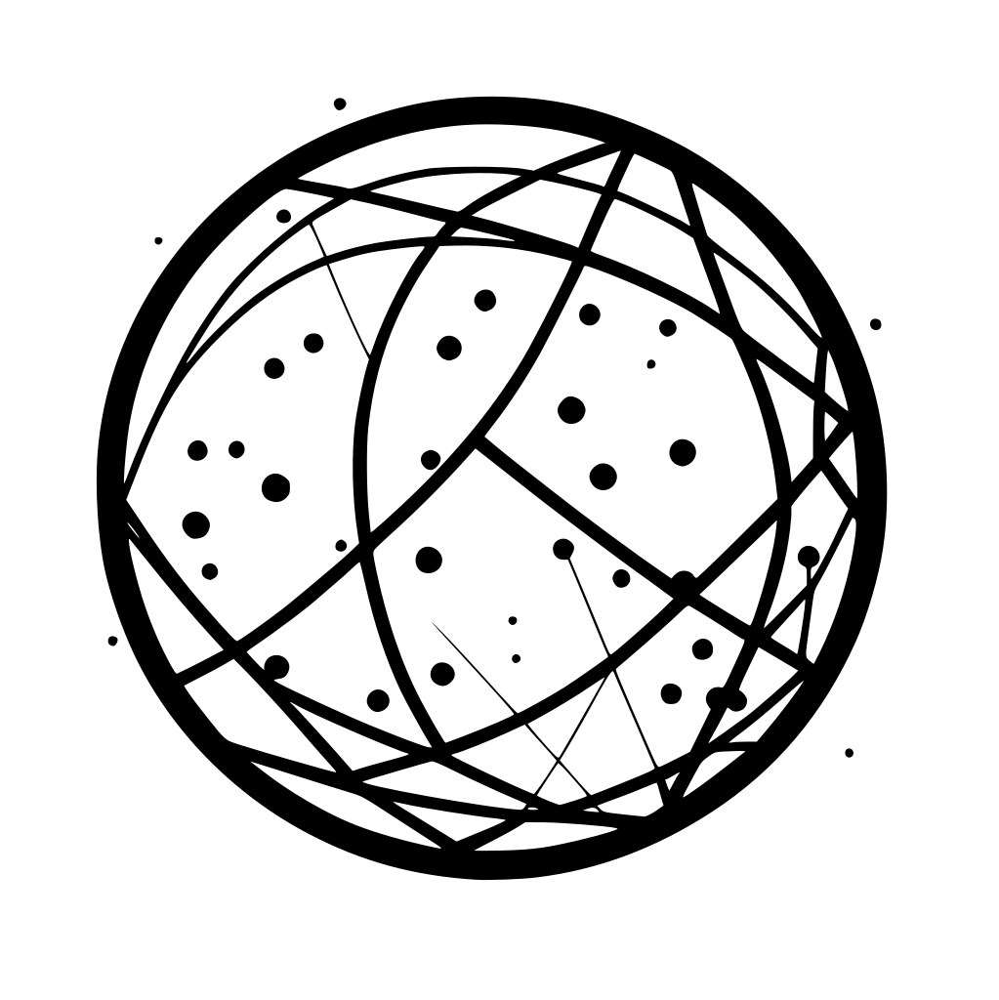
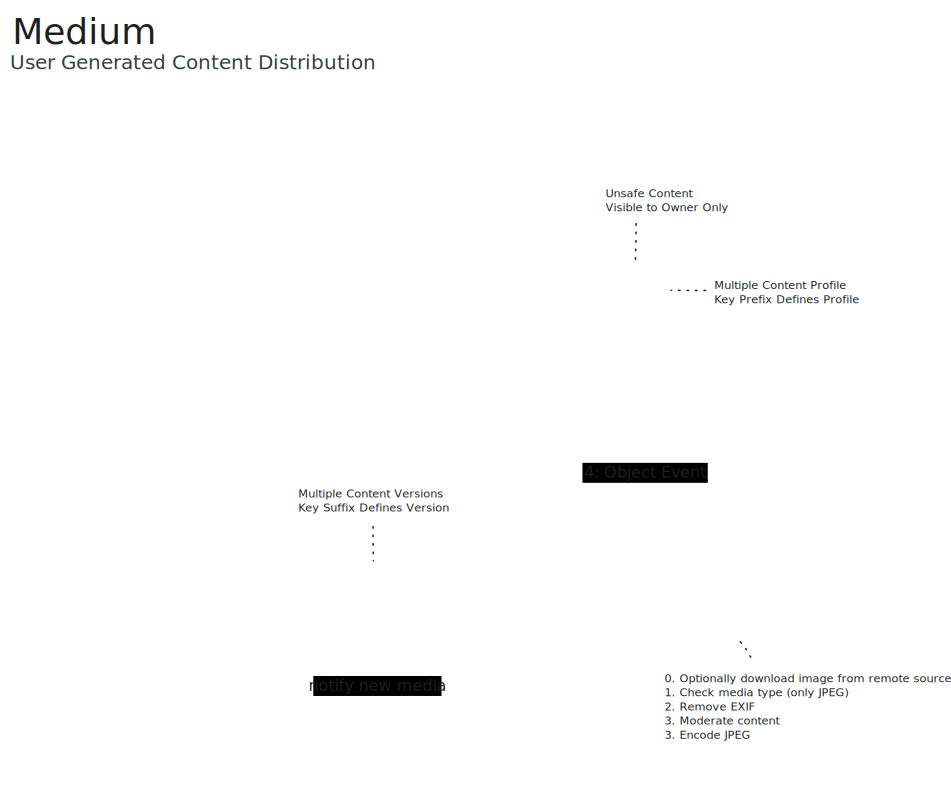

<p align="center">
  
  <h3 align="center">Medium for User Generated Content Distribution</h3>
  <p align="center"><strong>Secure and Compliant solution of distributing user-generated content.</strong></p>

  <p align="center">
    <!-- Documentation -->
    <a href="https://pkg.go.dev/github.com/fogfish/medium">
      
    </a>
    <!-- Build Status  -->
    <a href="https://github.com/fogfish/medium/actions/">
      
    </a>
    <!-- GitHub -->
    <a href="http://github.com/fogfish/medium">
      
    </a>
    <!-- Coverage -->
    <a href="https://coveralls.io/github/fogfish/medium?branch=main">
      
    </a>
  </p>
</p>

---

The library is AWS CDK L3 Construct that builds a solution for accepting a user-generated content and distributing it using AWS services. The construct builds AWS Cloud infrastructure and services for content processing including validation, moderation, transformation and distribution. 

## Inspiration

The construct is the transform function `ƒ : Media ⟼ []Media` that takes original media file and performs a series of transformations producing collection of modified files (e.g. moderation, scaling, etc). Obviously, this is a high-level abstraction which is implemented on top of AWS. The client interacts with this abstraction through uploading files to S3 bucket and consuming results through CDN.     



The construct allow definition of multiple processing profiles following a simple rule: the prefix of S3 Key identify the profile, each profile consists of processing stages that produces media files from the original one. Let's consider the photo sharing application as an example where user uploads a photo. The rendering of the photo requires multiple variants thumbnails, full screen preview and ability to download the original photo.

```
ƒ : jpeg ⟼ {small, thumb, cover, large, origin}
```

## Key features

* Out-of-the-box, **no-code** infrastructure for media object processing and distribution. 
* **Quarantine** uploaded media files before its distribution.
* Removal of EXIF metadata from uploaded images, supporting **privacy**.
* High-quality and configurable **down scale** of upload images to multiple resolutions.
* Support **download of 3rd party media** from various content sources.
* Captures failed processing jobs in dead letter queue (AWS SQS)

**Supported media formats**
- [x] JPEG : Digital Photography
- [x] JSON : Symbol links to media available in 3rd party content source.
- [x] [Open Issues if new format is required](https://github.com/fogfish/medium/issue)
  

## Quick Start

The construct is fully functional serverless application that uses Golang and AWS CDK, which is ether deployed as-is or imported as sibling stack into your application. The latest version of the construct is available at its `main` branch. All development, including new features and bug fixes, take place on the `main` branch using forking and pull requests as described in contribution guidelines.


### Requirements

Before Getting started, you have to ensure

* [Golang](https://golang.org/dl/) development environment v1.21 or later
* [AWS TypeScript CDK](https://docs.aws.amazon.com/cdk/latest/guide/getting_started.html)
* AWS Account with rights to deploy new stacks
* [Own domain](https://docs.aws.amazon.com/Route53/latest/DeveloperGuide/domain-register.html) configured at AWS Route 53
* [TLS certificate](https://docs.aws.amazon.com/AmazonCloudFront/latest/DeveloperGuide/cnames-and-https-requirements.html#https-requirements-aws-region) configured at AWS Certificate Manager us-east-1

### Configure processing pipeline

The construct is shipped with few [build-in config profiles](./awsmedium/config.go). You can either customize it or declare own profile. The config is built using simple DLS that defines actions to-do when anyone uploads photo to inbox s3 bucket. 

```go
// `On` defines a key prefix at S3 bucket, use `Of` to react on suffix.
// It triggers processing pipeline when object is uploaded into inbox.
//
// `Process` defines operation to be executed for media file.
medium.On("photo").Process(
  // ScaleTo defines processing step to the scale media into specified resolution
  medium.ScaleTo("small", 128, 128),   // ⇒ s3://{cdn}/photo/...small-128x128.jpg
  medium.ScaleTo("thumb", 240, 240),   // ⇒ s3://{cdn}/photo/...thumb-240x240.jpg
  medium.ScaleTo("cover", 480, 720),   // ⇒ s3://{cdn}/photo/...cover-480x720.jpg
  medium.ScaleTo("large", 1080, 1920), // ⇒ s3://{cdn}/photo/...large-1080x1920.jpg
  // Replica processing step copies media "almost" as-is
  medium.Replica("origin"),            // ⇒ s3://{cdn}/photo/...origin
)
```


### Running

The construct is deployable as standalone AWS CDK app. It is required to supply (a) config profile, (b) full qualified domain name for CDN and (c) certificate for TLS encryption.

```bash
cdk deploy \
  -c vsn=medium@main \
  -c config=photo \
  -c site=foobar.example.com \
  -c tls-cert-arn=arn:aws:acm:us-east-1:000000000000:certificate/dad...cafe \
  --all
```

On the completion, it creates entire infrastructure as defined by the diagram above. It uses S3 bucket `medium-{vsn}-inbox` as input and CDN `https://{site}` as output.

Upload media file to `s3://medium-{vsn}-inbox` the root folder is name of the profile (e.g. `photo`). It might contain any arbitrary path.

```bash
aws s3 cp my-media.jpg s3://medium-{vsn}-inbox/photo/a/b/c/my-media-photo.jpg
```

Processed object are accessible at CDN in few seconds. The processing preserves the absolute path but extension is inflated with resolution.

```bash
curl https://{site}/photo/a/b/c/my-media.{resolution}.jpg

curl https://{site}/photo/a/b/c/my-media.large-1080x1920.jpg
```

### Integration

The construct is also importable to any other AWS CDK app. See for usage example [awscdk.go](./cmd/cloud/awscdk.go). Use Config DLS to declare own processing pipeline.

```go
import (
	"github.com/aws/aws-cdk-go/awscdk/v2"
	"github.com/fogfish/medium/awsmedium"
)

// Creates distribution layer
awsmedium.NewEdge(/* ... */)

// Creates codec layer
awsmedium.NewCodec(app, jsii.String("you-stack-name"),
  &awsmedium.CodecProps{
    StackProps:        config,
    Version:           vsn,
    Profiles:          medium.On("photo").Process(
      medium.ScaleTo("small", 128, 128),
      medium.ScaleTo("thumb", 240, 240),
      medium.ScaleTo("cover", 480, 720),
      medium.ScaleTo("large", 1080, 1920),
      medium.Replica("origin"),
    ),
    // See awsmedium/stack.go for config details
  },
)
```

## How To Contribute

The library is [MIT](LICENSE) licensed and accepts contributions via GitHub pull requests:

1. Fork it
2. Create your feature branch (`git checkout -b my-new-feature`)
3. Commit your changes (`git commit -am 'Added some feature'`)
4. Push to the branch (`git push origin my-new-feature`)
5. Create new Pull Request


### commit message

The commit message helps us to write a good release note, speed-up review process. The message should address two question what changed and why. The project follows the template defined by chapter [Contributing to a Project](http://git-scm.com/book/ch5-2.html) of Git book.

### bugs

If you experience any issues with the library, please let us know via [GitHub issues](https://github.com/fogfish/medium/issue). We appreciate detailed and accurate reports that help us to identity and replicate the issue. 

## License

[](LICENSE)